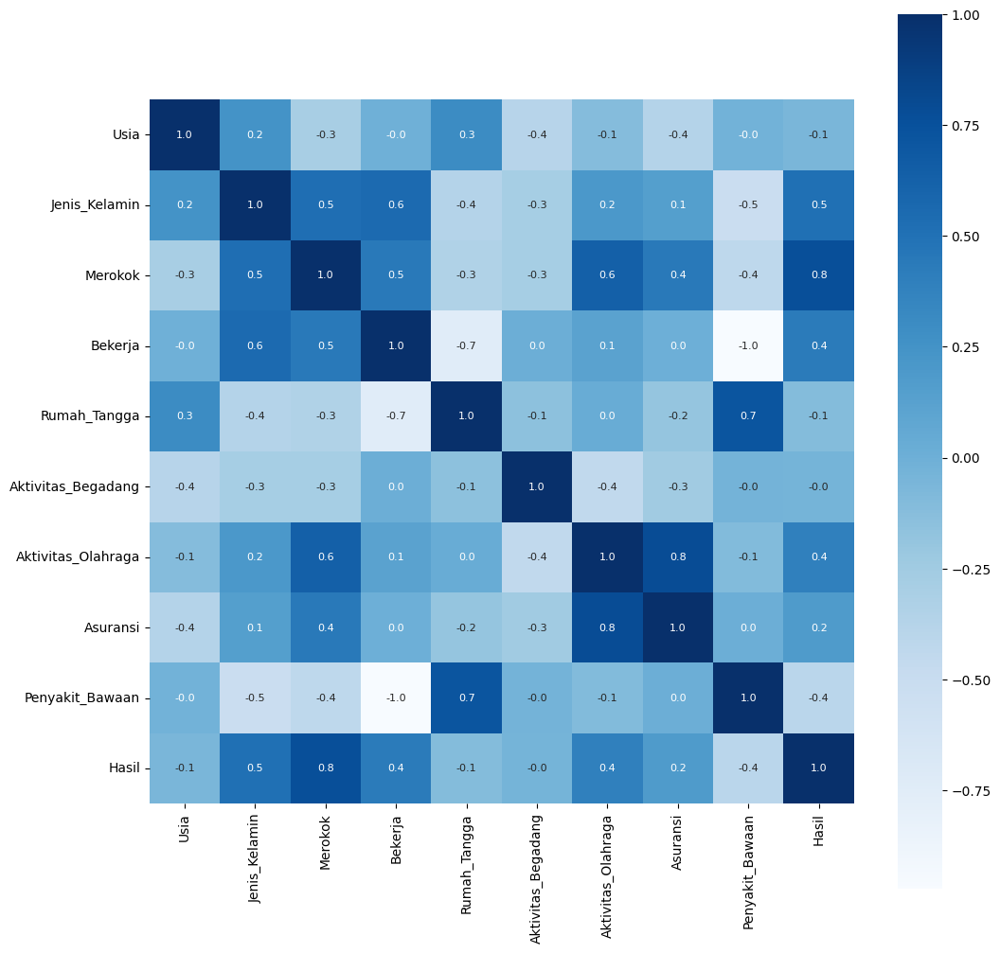

# Predik_Pemyakit_paru-paru
Repositori ini merupakan repositori untuk projek dalam pelatihan big data using python

## dataset
Memiliki 3000 dataset yang berisi data pasien yang terjangkit pengakit paru-paru atau tidak yang disertai dengan data pendukungnya

## visualisasi hubungan setiap kolom

## prediksi
sudah melakukan pengujian model yang menggunakan model random forest

